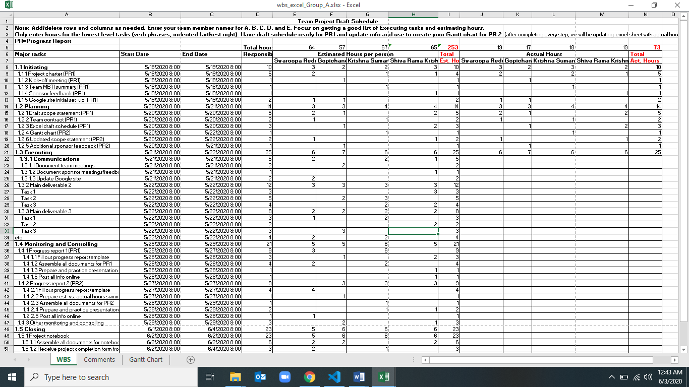
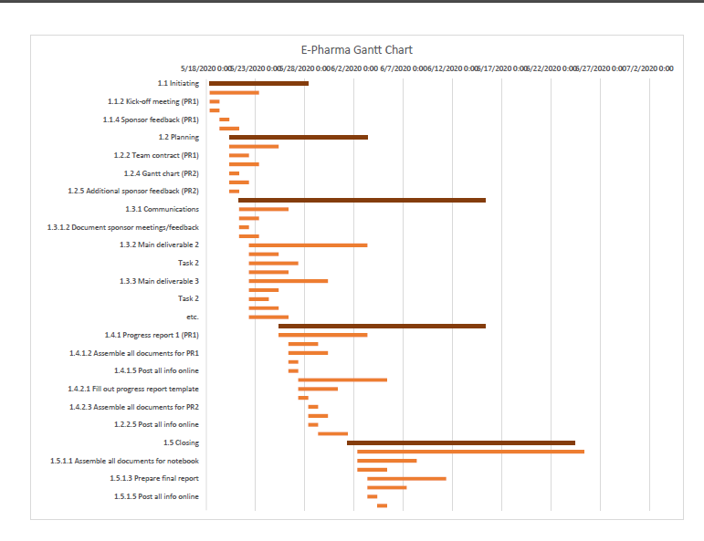
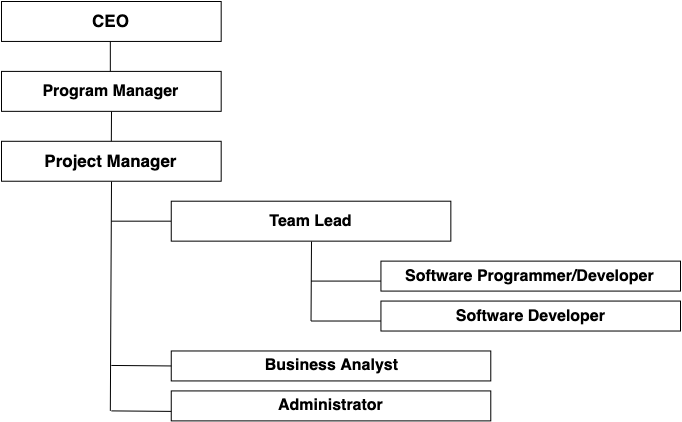
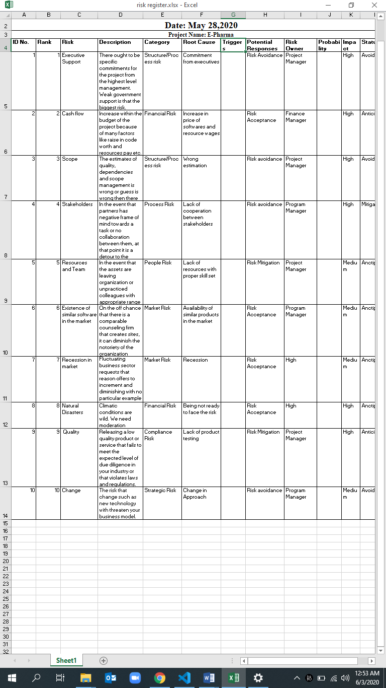
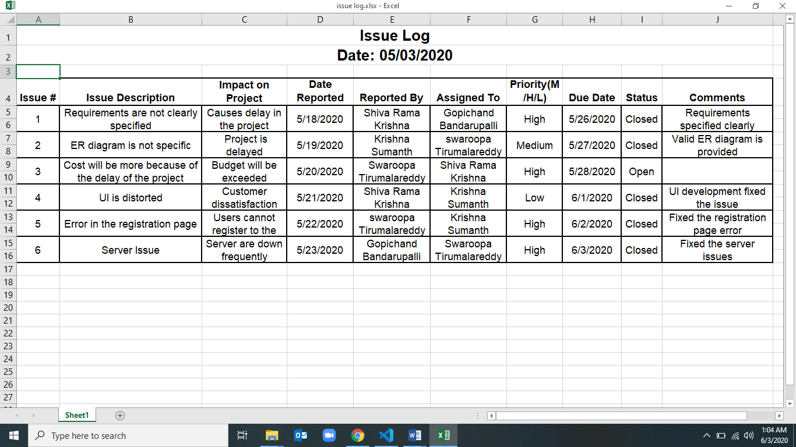

# E-Pharma Mobile Application

## Scenario:

 SRK Technologies is a software development Company that focuses on developing mobile applications for various clients. The company has currently acquired the project to develop a mobile application. The client has asked SRK Technologies to develop a mobile application where you can buy medicines required online by uploading prescription in the application.

## Statement of need: 

 It is an application which is useful for Drug distributors to update/add available drugs for customers. Customer can view/search for the availability of drugs from different drugstores.

## Team name: Fly High

## Team members:

1. Swaroopa Tirumalareddy
2. Gopichand  Bandarupalli
3. Krishna Sumanth Koyyalamudi
4. Shiva Rama Krishna Vodnala

## Client: Dr.Aziz Fellah

## Working as a team:

We all will be working together with co-ordination in organized manner. We will work together with diligence and motivation to lead a project toward success. As we all have defined the responsibilities of our individual roles, will look forward to work by supporting each other.

## Team Meeting:

Our team meets on Zoom online meeting site to keep track of the project on Every alternative days from 3:00PM to 5:30 PM.  In the team online meeting, we will discuss the progress of the work and difficulties faced during the project.

## Contacting:

The team shall stay in contact through e-mails and Zoom for Business. When there is emergency, we shall contact the team member using their personal mobile number.

## Dealing with a non-participating team member:

As we all are the active team participants, we hope that everyone actively works on this project. Due to any reasons any of the team member falls behind, all the other team members will be supporting and encouraging him/her.

## Knowledge Areas and their artifacts

1. Project Integration Management

    * Project Charter: A project charter is the statement of scope, objectives and people who are participating in a project. The                              charter also identifies the main stakeholders and defines the authority of the project manager
    * Project Management Plan: A Project management plan is a formal, approved document that defines how the project is executed,       monitored, and controlled. This document is used to define the approach project team takes to deliver the intended project management scope of the project

2. Project Scope Management

    * Requirement Management Plan
    * Requirements specifications Document
    * Scope Management Plan
    * Scope Statement
    * Work Breakdown Structure

3. Project Time Management

    * Schedule management plan
         + Gantt charts

4. Project Cost Management

    * Cost management plan
        + Cost estimation and determine budget

5. Project Quality Management

    * Quality management plan
        + Items included for Quality control
        + Benchmarking against other products or projects
        + Measurement regarding types of defects

6. Project Human Resources Management
    * Human resources management plan
        + Project organizational charts
        + Responsibility assignment matrices
        + Resource histograms

7. Project Communications Management

    * Communication management plan
        + Stakeholder Communication analysis

8. Project Risk Management

    * Risk management plan
        + Risk register
        + Risk mitigation strategies

9. Project Procurement Management

    * Procurement management plan
        + Statement of Work
        + Request for proposal

10. Project Stakeholder Management

    * Stakeholder management plan
        + Stakeholder register
        + Stakeholder analysis
        + Issue log
    * Final Presentation

                                 Milestone1

## Project Charter

### Project Title: E-Pharma

### Project Start Date:  05/18/2020  

### Projected Finish Date: 06/04/2020

### Budget Information: Self-sponsored

### Project Manager: Swaroopa Tirumalareddy

## Project Objectives: 

### Developing a mobile application which helps in buying medicine online.

## Success Criteria:
### Meeting triple constraints (scope, time and cost) and customer satisfaction. It is an application which is useful for Drug distributors to update/add available drugs for customers. Customer can view/search for the availability of drugs from different drugstores. This application helps customers to search for a drugstore along with availability of the desired drugs in stores up to date in Real. In addition, it also specifies if a store has delivery availability. Customers search for exactly needed medicine or they can explore given categories and options and can select any product or medicine from there which reduces a lot of effort. 

## Approach: Agile Approach

**Roles and Responsibilities** 

| **Name** | **Position** | **Internal/External** | **Project Role** | **Contact Information** |
| --- | --- | --- | --- | --- |
| Swaroopa Tirumalareddy | Manager and Content Writer | Internal | Project Manager | [S538426@nwmissouri.edu](mailto:S538426@nwmissouri.edu) |
| Gopichand Bandarupalli | Developer | Internal | Team Member | [S538305@nwmissouri.edu](mailto:S538305@nwmissouri.edu) |
| Krishna Sumanth Koyyalamudi | Developer and Content Writer | Internal | Team Member | S538345@nwmissouri.edu |
| Shiva Rama Krishna Vodnala | Lead | Internal | Team Member | S538103@nwmissouri.edu |

## Stakeholder Register for E-Pharma

**Prepared by:** Swaroopa Tirumalareddy **Date:** 05/18/2020

| **Name** | **Position** | **Internal/External** | **Project Role** | **Contact Information** |
| --- | --- | --- | --- | --- |
| Swaroopa Tirumalareddy | Manager and Content Writer | Internal | Project Manager | [S538426@nwmissouri.edu](mailto:S538426@nwmissouri.edu) |
| Gopichand Bandarupalli | Developer | Internal | Team Member | [S538305@nwmissouri.edu](mailto:S538305@nwmissouri.edu) |
| Krishna Sumanth Koyyalamudi | Developer and Content Writer | Internal | Team Member | S538345@nwmissouri.edu |
| Shiva Rama Krishna Vodnala | Lead | Internal | Team Member | S538103@nwmissouri.edu |
| Dr.Aziz Fellah | Client | External | User | [afellah@nwmissouri.edu](mailto:afellah@nwmissouri.edu) |

                              Milestone2

## Project Charter

### Project Title: E-Pharma

### Project Start Date:  05/18/2020  

### Projected Finish Date: 06/04/2020

### Budget Information: Self-sponsored

### Project Manager: Swaroopa Tirumalareddy

## Project Objectives: 

### Developing a mobile application which helps in buying medicine online.

## Success Criteria:
### Meeting triple constraints (scope, time and cost) and customer satisfaction. It is an application which is useful for Drug distributors to update/add available drugs for customers. Customer can view/search for the availability of drugs from different drugstores. This application helps customers to search for a drugstore along with availability of the desired drugs in stores up to date in Real. In addition, it also specifies if a store has delivery availability. Customers search for exactly needed medicine or they can explore given categories and options and can select any product or medicine from there which reduces a lot of effort. 

## Approach: Agile Approach

## Roles and Responsibilities
### Shiva Rama Krishna Vodnala - Developer
### Krishna Sumanth Koyyalamudi - Developer and Content Writer
### Swaropa Tirumalareddy - Manager and Content Writer
### Gopichand Bandarupalli - Team Lead
**Stakeholder Register for E-Pharma**

**Prepared by:** Swaroopa Tirumalareddy **Date:** 05/18/2020

| **Name** | **Position** | **Internal/External** | **Project Role** | **Contact Information** |
| --- | --- | --- | --- | --- |
| Swaroopa Tirumalareddy | Manager and Content Writer | Internal | Project Manager | [S538426@nwmissouri.edu](mailto:S538426@nwmissouri.edu) |
| Gopichand Bandarupalli | Developer | Internal | Team Member | [S538305@nwmissouri.edu](mailto:S538305@nwmissouri.edu) |
| Krishna Sumanth Koyyalamudi | Developer and Content Writer | Internal | Team Member | S538345@nwmissouri.edu |
| Shiva Rama Krishna Vodnala | Lead | Internal | Team Member | S538103@nwmissouri.edu |
| Dr.Aziz Fellah | Client | External | User | [afellah@nwmissouri.edu](mailto:afellah@nwmissouri.edu) |

## Project Management Plan Version 1.0

**05/22/2020**

**Project Name:** E-Pharma

**Introduction/Overview of Project**

SRK Technologies is a software development Company that focuses on developing mobile applications for various clients. The company has currently acquired the project to develop a mobile application. The client has asked SRK Technologies to develop a mobile application where you can buy medicines required online by uploading prescription in the application.

**Project Organization**

Organizational Boundaries and Interfaces:

The observed structure is the organizational structure for our project. The authority is given hierarchical wise. Each person is given authority to his area of work and needs to report to the person who is in a level above him.

Project Responsibilities:

The main responsibility of the project is to deliver on time and with the expected quality. Project manager shall coordinate between the team lead, business analysts, administrator for the main domains of the project to work smoothly. The team lead shall have a report of working of the software developer and tester.

**Management and Technical Processes**

**Management Processes:**

Management Objectives and Priorities:

Management is involved at various level while delivering a product. The topmost priority is to deliver a quality product within the given budget and time. Management decides if a change request should be approved or not and keeps a check on the monthly status.

Assumptions, Dependencies, and Constraints:

We assume that the application has no other special accommodations unless specified by the client. The mobile application is dependent on the web portal. The project should satisfy the triple constraints: scope, quality and time.

Risk Management:

The risk should be identified at a root level to avoid any other further affects due to the risk. To handle the risk, the risk management team should come up with upgraded strategies and mitigation plans.

Monitoring and Controlling Mechanisms:

This phase is essential to monitor and control few of the processes to keep them under check. The deliverables will be monitored for quality, functionality and scope of the project.

Staffing Plan:

All the staff included for project are from various domains and areas of expertise like database administrator, testing, data analyst, software developer and project manager.

**Technical Processes:**

Methods, Tools, and Techniques:

The Application is developed in both Android and iOS. The technologies used are HTML, JavaScript, and PL/SQL-Oracle 11c. The most important tools are Microsoft Office Suite, Android Studio and Visual studio.

Software Documentation:

All the documents follow the standard document practices. All the team members strictly adhere to these practices and need to be reviewed by a senior management.

Project Support Functions:

The project is well supported by functions like management plans, daily scrums and sprint reviews. By monitoring the product life cycle from time to time, the project is well maintained under the given scope, budget and time.

**Work to Be Performed**

Work Packages:

Work packages are the artifacts that cover all the sub tasks per phase wise involved in the project. These include developing a software code, creating the required documents and deliver it to the testing team. The testing team handles the product through their tests against their test cases and return it to the developers with the required documents.

Dependencies:

The deadlines of the next phase depend on when the previous phase ends. A delay in one of these phases affects the subsequent phase. To avoid this, they need to be completed on time.

Resource Requirements:

Each of the resource needs a system and a workspace to work at. We will need 8 Windows machines that includes 5 with a developer&#39;s environment and 3 with a tester&#39;s environment. All these are well covered under the budget.

**Schedule Information**

The project has been started on 18/05/2020 and will end on 06/04/2020. The project management plan has a detailed schedule of the project.

**Budget Information:**

The budget of the project is $325,000. The project manager will accordingly allocate the budget to each of department, depending on the number of resources, usage, roles and responsibilities.

**References to Other Project Planning Documents:**

Information Technology Project Management 8e by Kathy Schwalbe

We have referenced many articles to know about how a project can be made more successful. We have studied the most outcomes of the successful projects and we will try to implement them in our project.

## Scope Statement (Version 1.0)

| **Project Title:** E-Pharma **Date:** 05/22/2020 **Prepared by:** Gopichand Bandarupalli |
| --- |
| **Project Justification:** SRK Technologies is a software development Company that focuses on developing mobile applications for various clients. The company has currently acquired the project to develop a mobile application. The client has asked SRK Technologies to develop a mobile application where you can buy medicines required online by uploading prescription in the application.
 |
| **Product Characteristics and Requirements:**
1. The application must be a user-friendly application.
2. It Should be approachable to all the customers.
3. The application must schedule an appointment and must provide the information regarding the medicines available in drug store to customers such as view request, available drugs, cost of drugs, etc.
4. Drugstore/supplier should be able to create the personal account
5. The access system must be secure and highly confidential.

 **Product User Acceptance Criteria:** 
The product must be delivered to client without any delay. The Product must meet all the functionalities and it must be of user-friendly interface 

**Summary of Project Deliverables**
**Project management-related deliverables:**
Business case, charter, team contract, scope statement, WBS, schedule, cost baseline, status reports, final project presentation, final project report, lessons-learned report, and any other documents required to manage the project.
**Product-related deliverables:** research reports, design documents, software code, hardware, etc.
1. An application prototype in which it demonstrates how the application will look and work.
2. An application with only the list of medicines.
3. A flexible architecture of the application where changes can be made to add or remove medicines and edit number and cost of particular drugs.
4. Finalized analysis and business solution

## Project Time Management

**Schedule Management Plan**

Here is a screenshot of WBS spreadsheet:

Here is the screenshot of Gantt chart of our project:

Gantt chart file is attached with the document

## Project Cost Management

**05/22/2020**

**Level of accuracy:**

We rounded the cost estimates to the nearest $100.

Level of accuracy for activity cost and contingency funds is 90 percent.

**Units of measure:**

Cost estimation is done in US Dollars.

**Organizational Procedures links:**

We use the WBS as a framework to provide the stability with estimates.

1. **Control thresholds:**

Change requests during programming might increase the project budget than estimated cost. - Fixing the bugs during the development could cost more than the estimated cost. - 10 percent of Variance allowed.

1. **Reporting formats:**

A monthly project status report will be submitted about the cost manageable. All the corrective actions needed in the cost management plan are reported in this document. This section describes the format and frequency of cost reports required for the project. This section would describe the format and frequency of cost reports required for the project. Reports are very useful for tracking progress and success of projects. Selecting of cost reporting formats plays an important role to display reports. It is better to use good reporting formats to display cost information effectively.

1. **Process Descriptions:**

Description of all the processes in cost management is documented.

**Note:** Cost estimation and determine budget is attached to the document.

                              Milestone3

## Quality Management Plan

**Date: May 28, 2020**

**Project Name: E-Pharma**

**Introduction:**

_Many people joke about the poor quality of IT products People seem to accept systems being down occasionally or needing to reboot there, PCs But quality is very important in many IT projects_ Project _SRK Technologies is a software development Company that focuses on developing quality check applications for various clients. The company has currently acquired the project to develop quality check equipment which can use by mobile application. The client has asked SRK Technologies to develop a mobile application where you can buy medicines required online by uploading prescription in the application_ managers are ultimately responsible for quality management on their projects

Several organizations and references can help project managers and their teams understand quality

  - International Organization for Standardization (www.iso.org)
  - IEEE (www.ieee.org)

**Quality Standards:**

_The International Organization for Standardization (ISO) defines quality as &quot;the degree to which a set of inherent characteristics fulfils requirements&quot; (ISO9000:2000)_

_Other experts define quality based on:_

  - _Conformance to requirements: The project&#39;s processes and products meet written specifications_
  - _Fitness for use: A product can be used as it was intended_

_Project quality management ensures that the project will satisfy the needs for which it was undertaken_

  - Identifying which quality standards are relevant to the project and how to satisfy them; a **metric** 
  is a standard of measurement

  - Performing quality assurance periodically evaluating overall project performance to ensure the project will satisfy the relevant quality standards

  - Performing quality control monitoring specific project results to ensure that they comply with the relevant quality standards

**Metrics:**

It is used for measuring different factors like performance, productivity, quality, etc.

The measurement generated in this particular project management tool is an actual value. It also sets a tolerance value that defines the allowable variations on the metric. For instance, if the objective stays within the budget by ± 20%, the quality metric is used to measure the cost of the deliverable to determine the percentage variance from the budget.

The use of quality metrics in the control quality process and quality assurance. Examples of the quality metrics include [cost](https://project-management-knowledge.com/definitions/c/cost-control/) control, on-time performance, failure rate and defect frequency.

**Problem Reporting and Corrective Action Process:**

Project managers have the immense task of juggling requirements and resources that are often not under their direct control in order to produce the required project deliverables within the limited constraints to which they must adhere (scope, time, quality, etc.).

Even if the perfect project plan could be designed and executed, it would not remove all of the risks that could ultimately impact a project. Plans must inevitably change for one reason or another.

During the phases of a project, it could be said that there are three major activities focused on reducing project risk. The first risk reduction activity occurs during project planning, when a proactive risk assessment is conducted and the identified risks are either mitigated or avoided (e.g., by modifying the project plan), transferred (such as through insurance) or accepted (by doing nothing and accepting that &quot;if it happens, it happens&quot;).

The second activity is the continual assessment of risk throughout the project. The final risk reduction activity is to hold a retrospective &quot;lessons learned&quot; at the end of the project, which will have the least impact on the current project but will serve to benefit others in the future.

**Supplier Quality and Control:**

_A control chart is a graphic display of data that illustrates the results of a process over time. The main use of control charts is to prevent defects, rather than to detect or reject them. Quality control charts allow you to determine whether a process is in control or out of control. When a process is in control, any variations in the results of the process are created by random events; processes that are in control do not need to be adjusted. When a process is out of control, variations in the results of the process are caused by non-random events; you need to identify the causes of those non-random events and adjust the process to correct or eliminate them_

## Staffing Management Plan

**Date:05/28/2020**

**Project Name** : E-Pharma

**Introduction:**

The main aim of the project is to build an application to buy medicines online. The application provides information about medicines available in various drug stores and cost of drugs it provides drug information to users and option to create drug seller to create personal account and sell drugs through application.

**Staffing Requirements**

This project will require the following internal staff:

- Project manager
- Project team members from HR department.
- Project team members from technology department to help with technical support.
- Informational department staff for software and hardware training.
- Project management staff to help with project management training.
- Contracting department staff to assist in project contracts.

**Staff Assignments:**

Project manager will work through functional managers to assign individual to the project.

The project manager interviews potential candidates for suitability. If particular expertise is required to be part of project the functional managers will assist in making expertise available employees will be paid overtime if needed.

**Training, Rewards, and Reassignment:**

Employees hired for this project will have appropriate experience or ability to learn and work in time. Project managers are responsible in providing challenging and happy work environment. Employees work is evaluated and provide appropriate points towards completed work and awarded for their work this doesn&#39;t salary if he or she is not performing well, project manager responsibility if any corrections should be required in reassignment of project.

## E-Pharma Organizational Chart

**Date:05/28/2020**

Here is the screenshot of Gantt chart of our project:

## Communication Management Plan Version 1.0

**Date May 28, 2020**

**Project Name** : E-Pharma

1. **Stakeholder communications requirements:**

| **Stakeholders** | **Document Name** | **Document Format** | **Contact Person** | **Due Date** |
| --- | --- | --- | --- | --- |
| Program Manager | Project status report | Email | Swaroopa TirumalareddyS538426@nwmissouri.edu | Every week |
| Team Lead | Project status report | Email | Gopichand BandarupalliS538305@nwmissouri.edu | Every week |
| Team member | Project documents | Email | Shiva Rama Krishna VodnalaS538103@nwmissouri.edu | Daily |
| Team member | Project documents | Email | Krishna Sumanth KoyyalamundiS536803@nwmissouri.edu | Daily |
| Team member | Project documents | Email | Gopichand BandarupalliS538305@nwmissouri.edu | Daily |
| Developer and Content writer | Test reports | Report | Krishna Sumanth KoyyalamundiS536803@nwmissouri.edu | End of each task |
| Sponsor | Budget analysis report | Report | Shiva Rama Krishna VodnalaS538103@nwmissouri.edu | One month before project commences |

1. **Communications summary:**

| **Stakeholders** | **Communications Name** | **Delivery Method/Format** | **Producer** | **Due/Frequency** |
| --- | --- | --- | --- | --- |
| Project steering committee | Weekly status report | Hard copy and short meeting | Swaroopa Tirumalareddy| Wed. mornings at 9 AM |
| Sponsor and champion | Monthly status report | Hard copy and short meeting | Shiva Rama Krishna Vodnala| First Thursday of month at 10 AM |
| Affected employees | Project announcement | Memo, e-mail, intranet site, and announcement at department meetings | Gopichand Bandarupalli,Krishna Sumanth Koyyalamundi| July 1, 2007 |
| Project team | Weekly status report | Short meeting | All team members | Tues. afternoons at 2:00. |

1. **Comments/Guidelines:**

The project information can be collected through different processes such as interviewing, face-to-face interactions and through productive meetings. Confidential project information can be stored in secure tool such as google tools that allows easy access to all the stakeholders.

1. **Escalation procedures for resolving issues:**

The issues need to be systematically resolved by raising tickets and resolving on the basis of priorities without missing SLAs.Any stakeholder with issues pertaining to the project must write a formal report and submit it to the relevant project team member. The recipient of the report will then discuss the issue with the Project manager and other team members if needed. If approved by the Project Manager, the team make the necessary changes to resolve the issue.

1. **Revision procedures for this document:**

The project team will decide on updating the Communications Management Plan if needed during the weekly meetings. If any changes are required, the project manager will discuss the changes with the relevant stakeholders before carrying them out.

1. **Glossary of common terminology:**

Stakeholder – An individual, group or an organization, who may affect, be affected by, or perceive itself to be affected by a decision, activity or outcome of a project.

Escalation – Escalation in project management is an anticipated rise in uncommitted costs of resources (labor, material, equipment) over time, due to reduced purchasing power of money.

## Risk Management Plan

**05/28/2020**

**Project Name:** E-Pharma

**1. Methodology:**

Risk management methodology is set to help, teach, and decrease project risks within our project. The risk model is based on the presence of one or more causes with a remote probability of conflict and one or more effects that will rise due to the existence of the event. In practice, both the known and unknown risks are marked with a reactive strategy.

**2. Roles and responsibilities:**

Project Manager Role is to sign and approve the Risk Management Plan, determine the risk management strategy, engage in the risk management method, and get control of risk reduction, preparation, and execution.

The Risk Officer is accountable for managing the risk management application, sponsoring risk identification activities, helping ideas during the execution of the risk management process, and assuring the Risk Register is prepared and the ranks assigned to risks. The Risk Officer is liable for administering the Project Manager with support and status about risk actions.

**3. Budget and schedule:**

The final aim when combining risk management into budget planning is to know the premises your budget is based upon.

Risk assessing a complete budget may look like a heavy task, but the perfect way of action when discussing the risks of any further process is to divide it into sections and take those with the greatest possible impact. Risk management team holds the budget and schedule in control on a regular base so as to take quick response on those risks and check from additional loss.

**4. Risk categories:**

In a project, the different categories of risks are strategic risk, technical risk, financial risk, market risk, compliance risk and many more.

**5. Risk probability and impact:**

Probability: Risk is an issue that has a chance of happening. The probability of it occurring can differ wherever from just over zero percent to just under a hundred percent.

Impact – Risk, by its very category, eternally has a adverse impact. But, the scope of the impact alters in words of cost and impact on health, human life, or some other important part.

**6. Risk documentation:**

Everything about documentation is saved in drive and updated periodically. Hard copies are shared during meetings within the team. We used soft copies for easy operation during our project.

**Risk Register**

This is a screenshot of risk register sheet

## Risk Mitigation

**05/28/2020**

**Project Name:** E-Pharma

As more project risks are identified throughout the project, they will be accessed by the Project Manager and Team Lead, and together with the project team will develop avoidance and mitigation strategies. These risks are used to update the Risk Register and the risk management plan to ensure these risks are being monitored in timely fashion and are responded to accordingly.

Both identified and future occurring project risks will be managed and controlled within the constraints of time, scope, and cost. The Project Manager, with the assistance of the Team lead will determine the best way to respond to each risk to ensure compliance with these constraints.

In worst case scenarios it may be necessary to allow flexibility to one of the project&#39;s constraints. If necessary, funding may be added to the project to allow for more resources in order to meet the project schedule and scope requirements. Time and scope are rigid project constraints and no flexibility. However, cost constraint will only be allowed to be flexible in extreme cases where no other risk avoidance or mitigation strategy will work.

**Risk Mitigation Strategies:**

| **Risk Rank** | **Major Risks** | **Strategies to mitigate risks** | **Responsibility** |
| --- | --- | --- | --- |
| 1 | Market Risk | Reviewing all the similar project in the market and should be calculated numerically | Project manager |
| 2 | Financial Risk | Allocating excess cost for the project for future financial problems. | Project Manager |
| 3 | Technical Risk | Emphasizing team support.Increasing the frequency of project monitoringImproving problem handling skills | Program manager and team lead |
| 4 | People Risk | Recruiting employees from diversified areas. | Project Manager 
| 5 | Structure process risk | Selecting most experienced project manager.Increasing the frequency of monitoring.Defining all the objectives clearly. | Project manager

                                 Milestone4

## Procurement Management Plan

**Date:** 06/03/2020

**Project Name** : E-Pharma

**Guidelines on Types of Contracts:**

**Types of Contracts: -**

There are generally 3 types of bilateral (signed by 2 parties) contracts:

1. Cost reimbursable (or Cost Plus)
2. Fixed price
3. Time and Material contracts.

Cost reimbursable (or Cost Plus) Cost reimbursable (CR) contracts involve payment based on sellers&#39; actual costs as well as a fee or incentive for meeting or exceeding project objectives. Therefore, the buyer bears the highest cost risk.

Fixed Price Contracts Fixed price (FP) contracts (also called lump-sum contracts) involve a predetermined fixed price for the product and are used when the product is well defined. Therefore, the seller bears a higher burden of the cost risk than the buyer.

Time and Material Contracts

Time and material (T&amp;M) contracts (sometimes called Unit Price Contracts) contain characteristics of both fixed price and cost reimbursable contracts and are generally used for small project cost amounts. These contracts may be priced on a per-hour or per-item basis (fixed price) but the total number of hours or items is not determined (open-ended cost type arrangements like CR contracts). T&amp;M contracts are often used for staff augmentation, acquisition of experts and any outside support, when a precise statement of work cannot be quickly prescribed. A Purchase Order is a simple form of unit price contract that is often used for buying commodities. It is a unilateral contract and only signed by 1 party instead of the above bilateral contracts that are signed by both parties.

**Few Tips: -**

| **Contract Type** | **Priorities ( Least to Important )** |
| --- | --- |
| Costs plus fixed fee(CPFF) | Cost, Time, Performance |
| Costs plus award fee (CPAF) | Cost, Time, Performance |
| Costs plus incentive fee_ ** ** _(CPIF) | Time, Performance, Cost |
| Time and material (T&amp;M) | Performance, Time, Cost |
| Fixed price plus incentive fee_ ** ** _ (FPIF) | Time, Performance, Cost |
| Fixed Price Contracts (FP) | Cost, Time, Performance |

**Standard procurement documents or templates:**

**Types of Procurement Documents**

A few types of procurement documents are:

- **RFP -**  A request for proposal is an early stage in a procurement process issuing an invitation for suppliers, often through a bidding process, to submit a proposal on a specific commodity or service.
- **RFI -**  A request for information (RFI) is a proposal requested from a potential seller or a service provider to determine what products and services are potentially available in the marketplace to meet a buyer&#39;s needs and to know the capability of a seller in terms of offerings and strengths of the seller.
- **RFQ -**  A request for quotation (RFQ) is used when discussions with bidders are not required (mainly when the specifications of a product or service are already known) and when price is the main or only factor in selecting the successful bidder.
- **Solicitations:**  These are invitations of bids, requests for quotations and proposals. These may serve as a binding contract.
- **Offers -**  This type of procurement documents are bids, proposals and quotes made by potential suppliers to prospective clients.
- **Contracts -**  Contracts refer to the final signed agreements between clients and suppliers.
- **Amendments/Modifications -**  This refers to any changes in solicitations, offers and contracts. Amendments/Modifications have to be in the form of a written document.

**Guidelines for creating procurement documents** :

- **Information Gathering -**  A potential customer first researches suppliers, who satisfy requirements for the product needed.
- **Supplier Contact -**  When a prospective supplier has been identified, the customer requests for quotations, proposals, information and tender. This may be done through advertisements or through direct contact with the supplier.
- **Background Review -**  The customer now examines references for the goods/services concerned and may also consider samples of the goods/services or undertake trials.
- **Negotiation -**  Next the negotiations regarding price, availability and customization options are undertaken. The contract regarding the purchase of the goods or services is completed.
- **Fulfilment -**  Based on the contract signed, the purchased goods or services are shipped and delivered. Payment is also completed at this stage. Additional training or installation of the product may also be provided.
- **Renewal -**  Once the goods or services are consumed or disposed of and the contract has expired, the product or service needs to be re-ordered. The customer now decides whether to continue with the same supplier or look for a new one.

## Roles and Responsibilities
### Shiva Rama Krishna Vodnala - Developer
### Krishna Sumanth Koyyalamudi - Developer and Content Writer
### Swaropa Tirumalareddy - Manager and Content Writer
### Gopichand Bandarupalli - Team Lead

## Contract Statement of Work

**Date:** 06/03/2020

**Project Name** : E-Pharma

**Contract Name** : Online Medicine

**Scope of Work:**

Hardware tools like Xamarin, RhoMobile, NativeScript are used to develop both android and IOS apps, as the mobile application needs to be developed for both android and IOS

Software&#39;s that are used to develop android applications are Android Studio, Android Debug Bridge (ADB), AVD Manager, Eclipse etc. Software that are used to develop IOS applications are XCode, AppCode, Code Runner, RxSwift etc. Selenium for testing both android and IOS applications. Oracle and SQL for Database. WhatsApp and Skype for instant messages and conference calls.

**Location of Work:**

The work has to be completed from office only, the hardware and software have to be located in the same building.

**Period of Performance:**

The work is expected to begin on May 13 and expected to be completed on June 6 and the minimum number of working hours per day are 8 and the number of hours that can be charged per week is 40-45 and the work has to be done only in the office.

**Deliverables Schedule:**

| **Deliverable** | **Description** | **Due date** |
| --- | --- | --- |
| Project charter | It contains information about key schedule milestones, budget information, project manager, project objectives, success criteria, approach, roles and responsibilities of stakeholders | 05/23/2020 |
| Scope statement | It contains project justification, project characteristics and requirements, Project management-related deliverables, Product-related deliverables | 05/23/2020 |
| Project management plan | It contains an introduction of the project, project organization, managerial process, Technical Process, Work packages, schedule, and budget | 05/23/2020 |
| Scope management plan | It contains How to prepare a detailed project scope statement, how to create a Work Breakdown Structure, how to maintain and approve the WBS, how to obtain formal acceptance of the completed project deliverables, how to control requests for changes to the project scope: | 05/23/2020 |
| Schedule management plan | It contains Project schedule model development, The scheduling methodology, Level of accuracy and units of measure, Control thresholds, Rules of performance measurement, Reporting formats, Process descriptions | 05/23/2020 |
| Human resources management plan | It involves identifying and documenting project roles, responsibilities, and reporting relationships and contents include project organizational charts, staffing management plan, responsibility assignment matricesand resource histograms.| 05/28/2020 |
| Communication management plan| It is a document that guides project communications the communications management plan varies with the needs of the project, but some type of written plan should always be prepared. | 05/28/2020 |
| Risk management plan| It includes methodology, roles and responsibilities, budget and schedule, risk categories, risk probability and impact, revised stakeholders&#39; tolerances and risk documentation| 05/28/2020 |
| Stakeholder register | It contains names, position, project role, and contact information of the employee | 06/04/2020 |
| Final product | This is the final deliverable of the project | 06/04/2020 |
| Final documentation | This is the final document which is prepared by the project has completed | 06/04/2020 |

**Applicable Standards:**

On everyday basis, programmers must execute at least 700 lines of code and it must be clear and understandable to all. In accordance with the required standards, testing must be carried out.

**Acceptance Criteria:**

The client will be checking whether we fulfilled all the given requirements and also examines the quality of the product.

**Special Requirements:**

The mobile application must be a user-friendly application and it should be accessible to all the instructors of the university. The mobile application must be able to schedule a lecture and must provide the information regarding the lecture such as venue, time and students enrolled for the lecture.

## Request for proposal- E-Pharma

**Date**: 06/03/2020

**Project Name: E-Pharma**

**Purpose of RFP:** The purpose is to develop and upgrade web application for E-Pharma on both android and iOS systems.

**Background Information:** E-Pharma is a software development company whose main business focus is to develop web applications for Management systems.

**Basic Requirements:**

A desktop or Laptop Computer

External Hard Drive

Network Server

Wireless Router

Quality Printer

**Hardware and Software Environment:**

Android and iOS compatible. Android devices with version 5.0

Swift 5.0.1 compatibility.

iOS devices from iOS 10.x should support.

XCode IDE is to be used.

Android studio 3.5 compatibility.

Android devices with version 5.0.

Use of MySQL and Oracle as the main databases.

**RFP Process:** The association makes use of specialized machinery and software and programming. Capacity servers need to be wary of overburden The framing has to be fine.

**Statement of work and Schedule Information:** This entire cycle takes about twelve days. Inspecting the work area for preparing and transferring equipment-installing 3 days-2 days, installing equipment-5 days. Checking the systems installed-2 days.

**Appendices:**

a. Current system overview-current management system systems need upgrading.

a. Compatibility with system and Advanced expandable storage devices.

c. Size and Volume data specifies the data cannot exceed 20 TB.

## Stakeholder Management Strategy for E-Pharma

**Prepared by:** Krishna Sumanth **Date:** June 3, 2020

| **Name** | **Level of Interest** | **Level of Influence** | **Potential Management Strategies** |
| --- | --- | --- | --- |
| Swaroopa Tirumalareddy | High | Neutral | Swaroopa gives details to the project. It is smarter to include her in week after week and month to month gatherings online and take audit with respect to the expectations. |
| ShivaRama Krishna Vodnala| high | Supportive | Shiva Rama Krishna is by all accounts progressively intuitive, with great relational abilities. He has been with the organization for a long time. He should be associated with week by week exchanges for prompting. |
| Krishna Sumanth Koyyalamudi | high | Leading | Krishna has decent ordering aptitudes and great programming learning. He can screen the undertaking status. He disheartens himself for each blunder. He needs support to work. |
| Gopichand Bandarupalli| medium | Leading | Gopichand has best initiative characteristics. He can arrange with colleagues and check the task advance. He can choose representatives with important stuff. He needn&#39;t bother with anyone to include in his work, all he needs is a specialist over the work. |

## Stakeholder Register for E-Pharma

**Prepared by:** Swaroopa Tirumalareddy **Date:** June 3, 2020

| **Name**| **Position** | **Internal/External** | **Project Role** | **Contact Information** |
| --- | --- | --- | --- | --- |
|Shiva Rama Krishna Vodnala  | Team Lead and Developer | **Internal** | Team Member | S538103@nwmissouri.edu |
| Krishna Sumanth Koyyalamudi  | Developer and Content Writer| **Internal** | Team Member | S538345@nwmissouri.edu |
| Swaroopa Tirumalareddy  | Manager and Content Writer | **Internal** | ProjectManager | [S538426@nwmissouri.edu](mailto:S538426@nwmissouri.edu) |
| Gopichand Bandarupalli  | Developer | **Internal** | Team Member | [S538305@nwmissouri.edu](mailto:S538305@nwmissouri.edu) |

## Issue Log

Screenshot of issuelog

